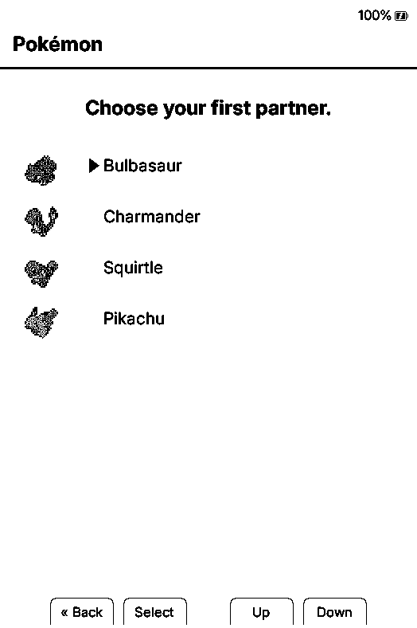
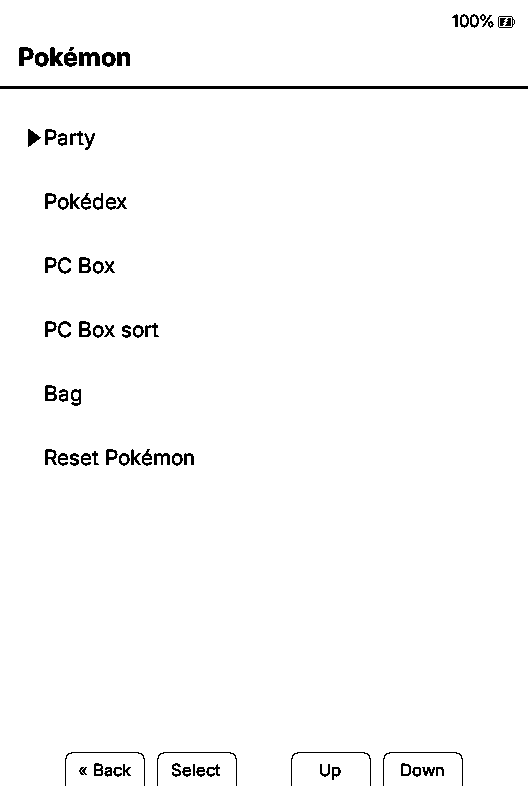
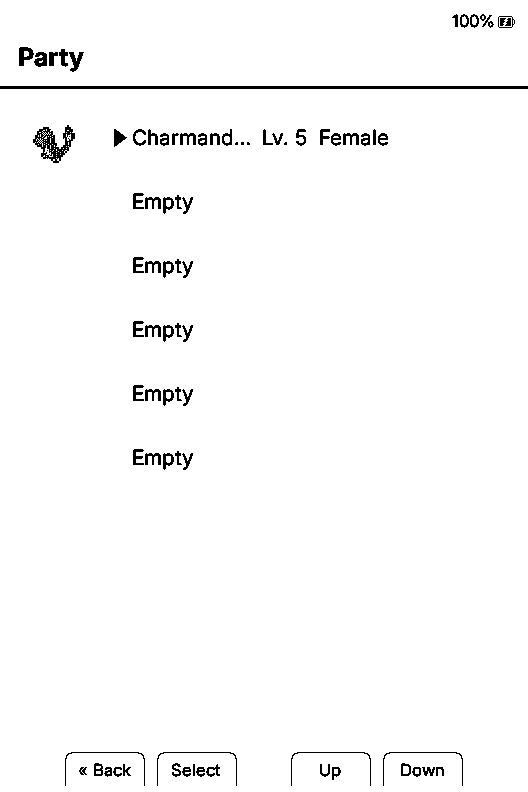
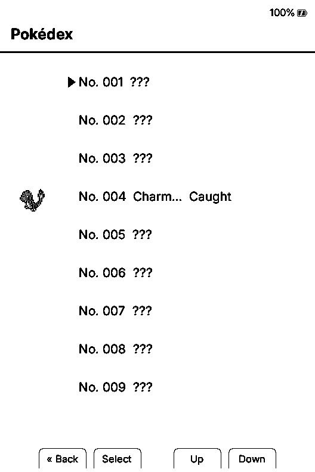
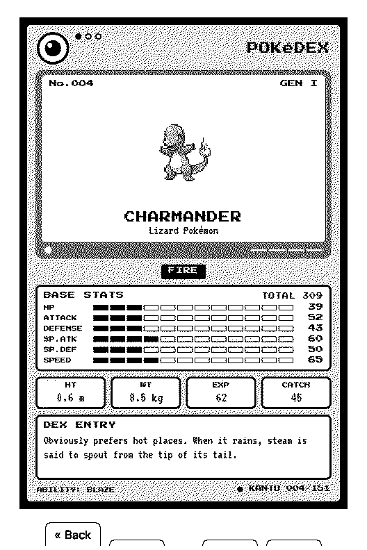

# Xteink Pokémon Game

This project was inspired by [the reading companion idea built by Joshua Miller](https://github.com/JoshuaMillerCode/crosspoint-reader-companion). I started by bringing CrossInk up to date with the current CrossPoint 1.5 release. Then I adapted the reading companion idea into a lightweight Pokémon game built around CrossInk's reading sessions and dashboards.

Real page turns train your lead Pokémon, trigger encounters and item finds, and let you build a party and Pokédex while you read.

The first release has been installed and tested on a physical Xteink X3.

## How it works

Put the Pokémon you want to train at the top of your Party. As you read, it gains experience and levels up.

Every 15–60 minutes of active reading, a wild Pokémon encounter or item find can occur. A `!` on the dashboard tells you something is waiting in the Pokémon menu.

The Pokémon you encounter is random, but your progress through the current book influences its level and rarity. Catch, train, and evolve Pokémon to complete the original 151 entries in the Pokédex.

Only active reading counts. Leaving a book open does not train your Pokémon.

## Screenshots

These are current X3 simulator captures using the artwork included in the full install.

| Starter selection | Pokémon menu |
| --- | --- |
|  |  |

| Party | Summary |
| --- | --- |
|  |  |

| Pokédex | Pokédex entry |
| --- | --- |
|  |  |

## How to play

1. Choose Bulbasaur, Charmander, Squirtle, or Pikachu as your first partner. Choose its gender and give it a nickname if you want one.
2. Put the Pokémon you want to train at the top of your Party. Only your lead Pokémon gains experience while you read.
3. When a `!` appears on the dashboard, open the Pokémon menu to see what happened.
4. Catch or pass on wild Pokémon. Your Party holds six. Additional Pokémon are sent to the PC Box.
5. Reorder your Party and deposit or withdraw Pokémon from the PC Box.
6. Use evolution stones and Link Cables from the Bag. Level-based evolutions ask before changing your Pokémon and can be turned off from its summary.
7. Fill the original 151 Pokédex by catching and evolving Pokémon.

## Download and install

- [**Download from GitHub Releases**](https://github.com/padge01/xteink-pokemon-game/releases)
- [Open the guided installer](https://padge01.github.io/xteink-pokemon-game/install.html)

This build is for the **Xteink X3 only**. Do not install it on an X4, X4 Pro, Sticky, or another device. Back up the SD card before updating.

1. Download the full-install ZIP to a computer.
2. Extract the ZIP. Do not copy the ZIP itself to the SD card.
3. Back up any `/.crosspoint/pokemon*.bin` files if they already exist. Earlier `pokemon-v2-a.bin` and `pokemon-v2-b.bin` saves migrate automatically.
4. Copy `update.bin` to the SD-card root and merge the extracted `pokemon` folder into the root.
5. **Do not format the SD card. Do not delete any existing folder. Do not replace any existing folder.** Keep your books, sleep covers, settings, reading progress, and Pokémon saves in place.
6. Confirm both `update.bin` and the visible `pokemon` folder are directly at the SD-card root.
7. Safely eject the card and return it to the X3.
8. Open **Settings → System → SD Card Firmware Update**, select `update.bin`, and confirm.

The full-install ZIP contains the firmware and all required artwork. It does not contain or replace Pokémon saves, books, or reading data. The first release that moves artwork to `/pokemon` must be installed from the full ZIP; later releases can use the firmware-only download over the X3's Wi-Fi file transfer.

The [download and install guide](https://padge01.github.io/xteink-pokemon-game/install.html) always points to the latest release and includes both update options.

## Support

Xteink Pokémon Game is free and open source. If it has made reading more fun and you would like to support continued development and testing, you can leave an optional tip on [Ko-fi](https://ko-fi.com/padge01).

## Credits

- [CrossInk](https://github.com/uxjulia/CrossInk): the reader firmware, reading-session tracking, dashboards, and foundation for this project
- [CrossPoint Reader](https://github.com/crosspoint-reader/crosspoint-reader): the original firmware and upstream 1.5 improvements brought into this CrossInk build
- [Joshua Miller's CrossPoint Reader Companion](https://github.com/JoshuaMillerCode/crosspoint-reader-companion): the reading companion concept and verified-reading behavior
- [PokeAPI Sprites](https://github.com/PokeAPI/sprites): the source for the adapted Pokémon sprites
- [u/xDaftTurtle's Pokédex sleep-screen project](https://www.reddit.com/r/XTEINK/comments/1ve0pr4/comment/p1lpy0w/?context=3): the adapted X3 Pokédex cards, created with [Tesserae](https://github.com/dmellok/tesserae)

See [NOTICE.md](NOTICE.md) and [Rights and attribution](RIGHTS_AND_ATTRIBUTION.md). Project code is covered by the inherited [MIT License](LICENSE).

Pokémon and related names, characters, and artwork belong to their respective rights holders. This is an unofficial fan project and is not affiliated with or endorsed by Nintendo, Creatures Inc., GAME FREAK Inc., The Pokémon Company, Xteink, CrossInk, or CrossPoint Reader. Optional tips support development and testing; they do not purchase access to Pokémon content.

## Development notes

- [Release checklist](docs/release-checklist.md)
- [Artwork and packaging](docs/artwork-setup.md)
- [Save-file formats](docs/file-formats.md)
