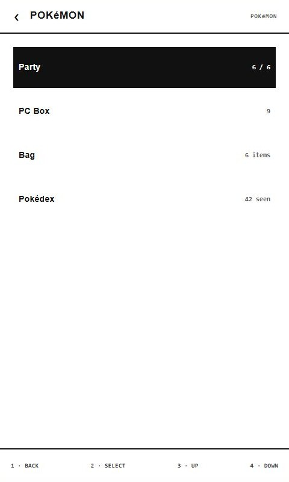
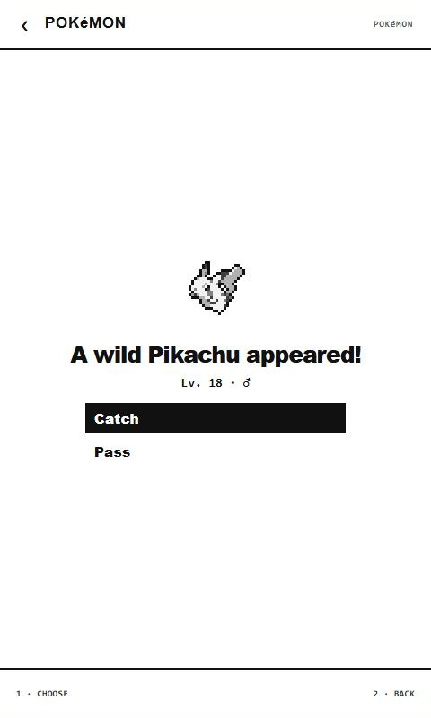
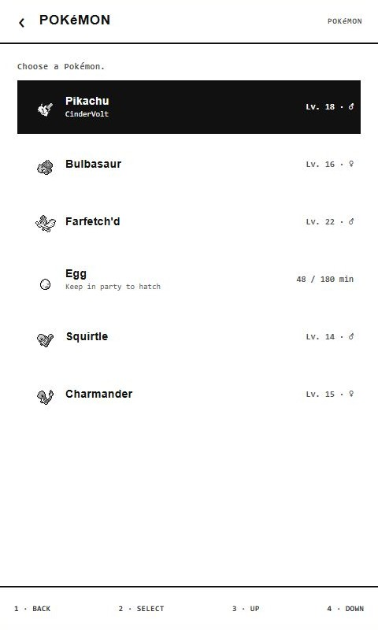
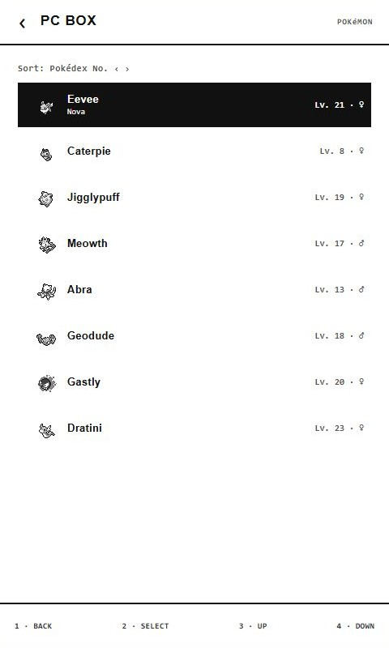
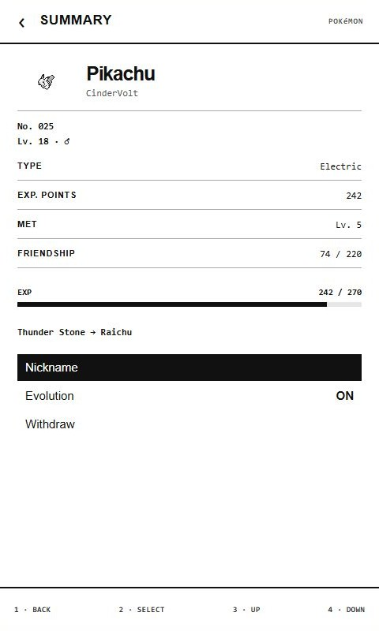
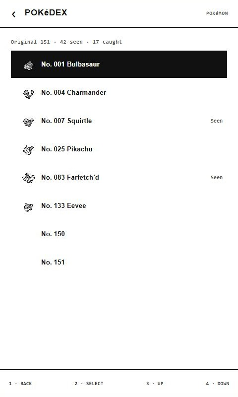

# Xteink Pokémon Game

I started this project by bringing CrossInk up to date with the official CrossPoint 1.5 release and selected X3-compatible improvements from the later 1.6 release candidate. I then adapted Joshua Miller's reading-companion idea into a lightweight Pokémon game built around CrossInk's existing reading sessions.

Real page turns train your lead Pokémon, trigger encounters and item finds, and let you build a party and Pokédex while you read.

[Download the full X3 install](https://padge01.github.io/xteink-pokemon-game/install.html)

## Interface preview

| Pokémon menu | Wild encounter |
| --- | --- |
|  |  |
| Party | PC Box |
|  |  |
| Pokémon summary | Pokédex |
|  |  |

## Requirements

- Xteink X3
- microSD card
- Computer with a microSD card reader for the full install
- SD-card backup before updating

Do not install this build on an X4, X4 Pro, Sticky, or another device.

## What it does

- Choose Bulbasaur, Charmander, Squirtle, or Pikachu as a first partner.
- Train the first Pokémon in your Party through verified reading activity.
- Carry six Pokémon and store the rest in the PC Box.
- Catch and evolve Pokémon from the original 151.
- Track seen and caught Pokémon in the Pokédex.
- Find evolution stones and Link Cables while reading.
- Show your lead Pokémon on supported CrossInk dashboards.
- Keep Pokémon saves separate from books and reading statistics.

It does not include battles, moves, breeding, trading, or combat statistics.

## Install

1. Download the full-install ZIP to a computer.
2. Extract the ZIP. Do not copy the ZIP file itself to the SD card.
3. Copy the extracted `update.bin` and `.crosspoint` folder to the SD-card root.
4. Merge `.crosspoint`; do not replace or delete the existing folder.
5. Return the card to the X3.
6. Open **Settings → System → SD Card Firmware Update**, select `update.bin`, and confirm.

The ZIP contains the firmware and required artwork. It contains no Pokémon saves, books, or reading data. Back up `/.crosspoint/pokemon-v2-a.bin` and `/.crosspoint/pokemon-v2-b.bin` before updating.

Use the [download and install guide](https://padge01.github.io/xteink-pokemon-game/install.html) for the full instructions and firmware-only updates.

## Firmware base

- [CrossInk](https://github.com/uxjulia/CrossInk)
- Official CrossPoint 1.5 release improvements adapted for CrossInk
- Selected later CrossPoint 1.6 RC improvements adapted for the X3
- Independent, unofficial build

## Credits

- [CrossPoint Reader](https://github.com/crosspoint-reader/crosspoint-reader): original firmware and upstream improvements
- [Joshua Miller's CrossPoint Reader Companion](https://github.com/JoshuaMillerCode/crosspoint-reader-companion): reading-companion concept and verified-reading behavior
- [PokeAPI Sprites](https://github.com/PokeAPI/sprites): source for adapted species sprites
- [Tesserae](https://github.com/dmellok/tesserae) and [u/xDaftTurtle's Pokédex cards](https://www.reddit.com/r/XTEINK/comments/1ve0pr4/comment/p1lpy0w/?context=3): Pokédex-card reference

See [NOTICE.md](NOTICE.md) and [Rights and attribution](RIGHTS_AND_ATTRIBUTION.md). Project code is covered by the inherited [MIT License](LICENSE).

Pokémon and related names, characters, and artwork belong to their respective rights holders. This is an unofficial, noncommercial project and is not affiliated with or endorsed by Nintendo, Creatures Inc., GAME FREAK Inc., The Pokémon Company, Xteink, CrossInk, or CrossPoint Reader.

## Development

- [Release checklist](docs/release-checklist.md)
- [Artwork contract](docs/artwork-setup.md)
- [File formats](docs/file-formats.md)
